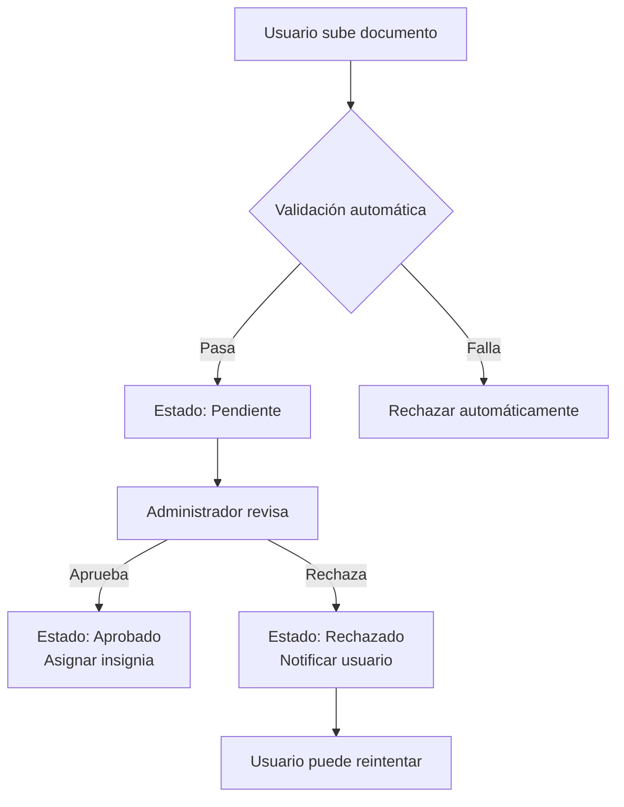
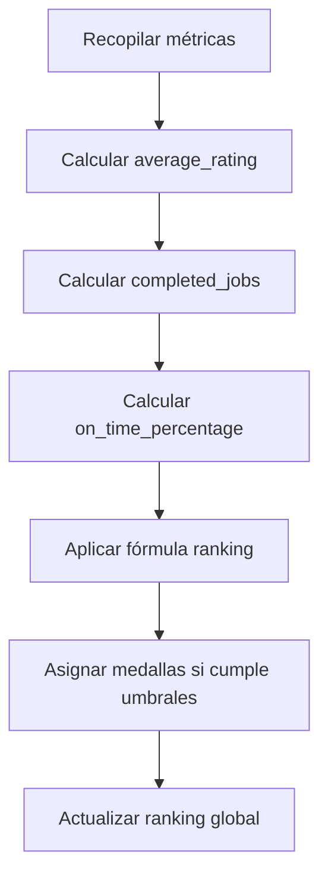

# Análisis Funcional Detallado: Módulo de Verificación de Identidad y Reputación

## 1. Interpretación Precisa de los Requerimientos

### REQ-36: Subida de Documento de Identidad
El sistema debe permitir a los usuarios profesionales subir un documento de identidad válido (como DNI, cédula o pasaporte) para iniciar el proceso de verificación. Esto incluye la interfaz de usuario para seleccionar y cargar el archivo, validaciones básicas de formato (PDF, JPG, PNG) y tamaño máximo (ej. 5MB), y almacenamiento seguro en la nube.

### REQ-37: Insignia "Verificado"
Una vez que el documento sea validado exitosamente, el sistema debe mostrar una insignia visual "Verificado" en el perfil del usuario. Esta insignia indica que la identidad ha sido confirmada, aumentando la confianza de los clientes. Solo usuarios con documentos válidos y aprobados obtienen esta insignia.

### REQ-38: Medallas por Logros
El sistema debe asignar medallas automáticas basadas en logros específicos del profesional, tales como:
- Puntualidad: Porcentaje alto de trabajos completados a tiempo.
- Buenas calificaciones: Promedio de reseñas superior a un umbral (ej. 4.5/5).
- Trabajos completados: Número acumulado de servicios finalizados exitosamente.

Las medallas se muestran en el perfil y se actualizan en tiempo real.

### REQ-39: Ranking por Reputación
El sistema debe calcular y mostrar un ranking global de profesionales basado en un puntaje de reputación. Este ranking se actualiza periódicamente y se ordena de mayor a menor reputación, visible en búsquedas y perfiles.

### REQ-40: Aprobación/Rechazo por Administrador
Los administradores deben tener una interfaz dedicada para revisar solicitudes de verificación pendientes. Pueden aprobar o rechazar basándose en la validación manual, con la opción de agregar comentarios. Las decisiones se notifican al usuario automáticamente.

## 2. Definición de Flujos Principales

### Flujo de Subida de Documento
1. Usuario accede a la sección de verificación en su perfil.
2. Selecciona y sube el documento de identidad.
3. Sistema valida formato y tamaño; si falla, muestra error.
4. Documento se almacena en estado "Pendiente".
5. Notificación enviada al usuario y administradores.

### Flujo de Validación Automática/Manual
1. Validación automática: OCR extrae datos (nombre, número de documento, fecha de expiración); verifica integridad básica.
2. Si automática falla o es sospechosa, pasa a manual.
3. Administrador revisa: compara datos con perfil, verifica autenticidad.
4. Decide aprobar o rechazar; actualiza estado.

### Estados del Proceso
- **Pendiente**: Documento subido, esperando validación.
- **Aprobado**: Validación exitosa, insignia asignada.
- **Rechazado**: Validación fallida, usuario puede reintentar.

### Flujo de Asignación de Insignia
1. Estado cambia a "Aprobado".
2. Sistema asigna insignia "Verificado" al perfil.
3. Actualiza visibilidad en búsquedas y perfiles.

### Flujo de Cálculo de Ranking y Medallas
1. Sistema calcula métricas periódicamente (diariamente/semanalmente).
2. Aplica fórmula de ranking.
3. Asigna medallas basadas en umbrales.
4. Actualiza ranking global y perfiles.

## 3. Reglas de Negocio Obligatorias

- **RB-01**: Solo usuarios con documento válido y aprobado obtienen la insignia "Verificado".
- **RB-02**: Medallas se asignan por:
  - Puntualidad: Porcentaje de trabajos a tiempo > 90%.
  - Buenas calificaciones: Average rating > 4.5.
  - Trabajos completados: > 50 servicios finalizados.
- **RB-03**: Fórmula de ranking = (average_rating * 0.6) + (completed_jobs * 0.3) + (on_time_percentage * 0.1).
- **RB-04**: Ranking se recalcula semanalmente y se muestra en top 100.
- **RB-05**: Administradores pueden bloquear usuarios fraudulentos.

## 4. Identificación de Riesgos y Casos Especiales

### Riesgos
- **Fraude**: Uso de documentos falsos, robados o deepfakes. Mitigación: Validación manual y comparación con datos biométricos futuros.
- **Errores de Validación**: Falsos positivos/negativos en OCR. Mitigación: Revisión humana obligatoria para casos dudosos.
- **Seguridad de Datos**: Exposición de documentos sensibles. Mitigación: Encriptación, acceso restringido, cumplimiento GDPR.
- **Sobrecarga Administrativa**: Alto volumen de solicitudes. Mitigación: Automatización inicial y priorización.

### Casos Especiales
- **Documentos Inválidos**: Borrosos, expirados, de baja calidad. Acción: Rechazar y permitir reenvío con instrucciones.
- **Usuarios Menores de Edad**: Verificar edad mínima (18+). Acción: Rechazar automáticamente.
- **Documentos Internacionales**: Pasaportes de otros países. Acción: Aceptar pero validar manualmente.
- **Múltiples Intentos**: Usuario reenvía tras rechazo. Acción: Limitar a 3 intentos por mes.
- **Discrepancias de Datos**: Datos extraídos no coinciden con perfil. Acción: Solicitar corrección o rechazar.

## 5. Diagramas de Flujo

### Diagrama de Flujo de Verificación de Identidad

### Diagrama de Flujo de Cálculo de Reputación

Este análisis proporciona una base sólida para el desarrollo del módulo, asegurando confianza y transparencia en la plataforma.