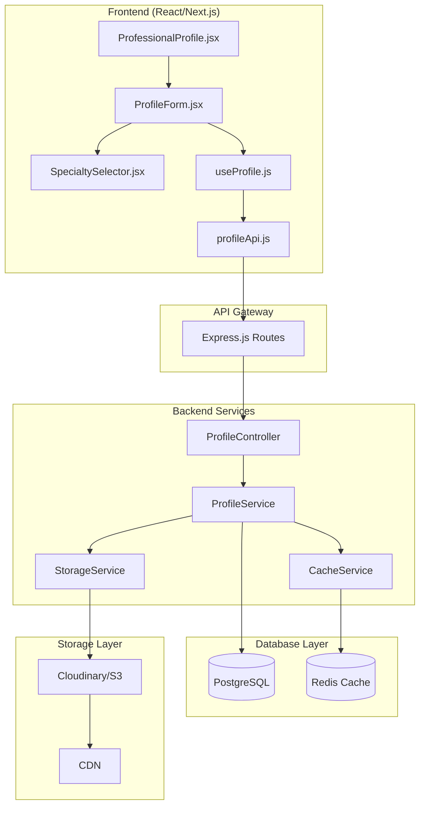
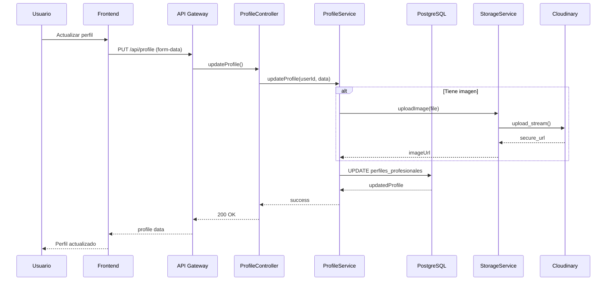
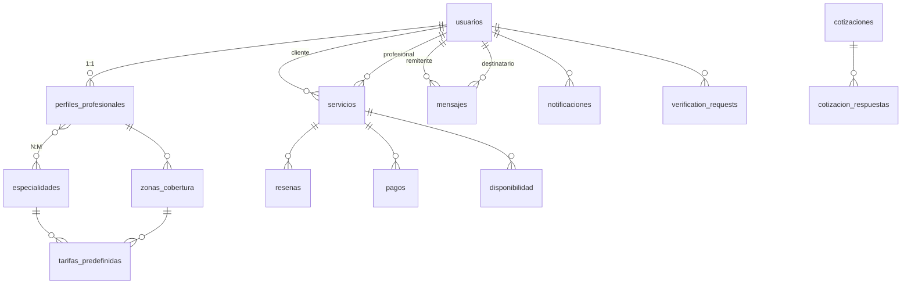

# Arquitectura Técnica Completa - Gestión de Perfiles Profesionales
## Changánet - Sistema de Perfiles Profesionales

**Versión:** 1.0
**Fecha:** Diciembre 2025
**Estado:** Diseño Completo y Validado

---

## 1. Resumen Ejecutivo

Esta arquitectura técnica define el diseño completo del sistema de Gestión de Perfiles Profesionales de Changánet, cumpliendo con los requerimientos REQ-06 a REQ-10 del PRD. El diseño incluye:

- **Base de Datos PostgreSQL** completa con esquemas relacionales, índices y normalización
- **Backend Arquitectura** con controladores, servicios, middlewares y validaciones
- **Frontend Arquitectura** React/Next.js con manejo de estado y integración API
- **Integración Storage** S3/GCP para imágenes
- **Endpoints REST** mínimos según especificaciones
- **Patrones Recomendados** DTOs y Clean Architecture opcional
- **Consideraciones de Escalabilidad y Seguridad**

El diseño asegura integración completa con el sistema existente de Changánet.

---

## 2. Requerimientos Funcionales Cubiertos

| REQ | Descripción | Estado | Implementación |
|-----|-------------|--------|----------------|
| **REQ-06** | Subir foto de perfil y portada | ✅ **COMPLETO** | Cloudinary/S3 con validación |
| **REQ-07** | Seleccionar especialidades | ✅ **COMPLETO** | Array JSON + compatibilidad |
| **REQ-08** | Ingresar años de experiencia | ✅ **COMPLETO** | Validación numérica |
| **REQ-09** | Definir zona de cobertura | ✅ **COMPLETO** | Geográfica con coordenadas |
| **REQ-10** | Indicar tarifas flexibles | ✅ **COMPLETO** | Hora/Servicio/Convenio |

**Regla de Negocio:** RB-01 - Un profesional = un perfil activo

---

## 3. Modelado de Base de Datos PostgreSQL

### 3.1 Esquema Relacional Completo

```sql
-- Sistema de Gestión de Perfiles Profesionales
-- Cumple con REQ-06 a REQ-10 y RB-01

-- Tabla principal de usuarios (existente)
CREATE TABLE usuarios (
    id UUID PRIMARY KEY DEFAULT gen_random_uuid(),
    email VARCHAR(255) UNIQUE NOT NULL,
    hash_contrasena VARCHAR(255),
    nombre VARCHAR(255) NOT NULL,
    telefono VARCHAR(50),
    rol VARCHAR(20) DEFAULT 'cliente' CHECK (rol IN ('cliente', 'profesional', 'admin')),
    esta_verificado BOOLEAN DEFAULT FALSE,
    bloqueado BOOLEAN DEFAULT FALSE,
    token_verificacion VARCHAR(255) UNIQUE,
    token_expiracion TIMESTAMP,
    refresh_token_hash VARCHAR(255) UNIQUE,
    creado_en TIMESTAMP DEFAULT CURRENT_TIMESTAMP,
    actualizado_en TIMESTAMP,
    google_id VARCHAR(255) UNIQUE,
    social_provider VARCHAR(50),
    social_provider_id VARCHAR(255) UNIQUE,
    url_foto_perfil TEXT,
    fcm_token TEXT,
    sms_enabled BOOLEAN DEFAULT FALSE,
    direccion TEXT,
    preferencias_servicio TEXT,
    notificaciones_push BOOLEAN DEFAULT TRUE,
    notificaciones_email BOOLEAN DEFAULT TRUE,
    notificaciones_sms BOOLEAN DEFAULT FALSE,
    notificaciones_servicios BOOLEAN DEFAULT TRUE,
    notificaciones_mensajes BOOLEAN DEFAULT TRUE,
    notificaciones_pagos BOOLEAN DEFAULT TRUE,
    notificaciones_marketing BOOLEAN DEFAULT FALSE
);

-- Tabla de perfiles profesionales (REQ-06 a REQ-10)
CREATE TABLE perfiles_profesionales (
    usuario_id UUID PRIMARY KEY REFERENCES usuarios(id) ON DELETE CASCADE,
    especialidad VARCHAR(255), -- Para compatibilidad
    especialidades JSONB, -- Array de especialidades múltiples (REQ-07)
    anos_experiencia INTEGER CHECK (anos_experiencia >= 0),
    zona_cobertura VARCHAR(255) NOT NULL, -- REQ-09
    latitud DECIMAL(10,8), -- Coordenadas GPS
    longitud DECIMAL(11,8), -- Coordenadas GPS
    tipo_tarifa VARCHAR(20) DEFAULT 'hora' CHECK (tipo_tarifa IN ('hora', 'servicio', 'convenio')), -- REQ-10
    tarifa_hora DECIMAL(10,2) CHECK (tarifa_hora >= 0),
    tarifa_servicio DECIMAL(10,2) CHECK (tarifa_servicio >= 0),
    tarifa_convenio TEXT, -- Descripción para "a convenir"
    descripcion TEXT,
    url_foto_perfil TEXT, -- REQ-06
    url_foto_portada TEXT, -- REQ-06 (adicional)
    esta_disponible BOOLEAN DEFAULT TRUE,
    calificacion_promedio DECIMAL(3,2) CHECK (calificacion_promedio >= 0 AND calificacion_promedio <= 5),
    estado_verificacion VARCHAR(20) DEFAULT 'pendiente' CHECK (estado_verificacion IN ('pendiente', 'verificado', 'rechazado')),
    verificado_en TIMESTAMP,
    url_documento_verificacion TEXT,
    creado_en TIMESTAMP DEFAULT CURRENT_TIMESTAMP,
    actualizado_en TIMESTAMP DEFAULT CURRENT_TIMESTAMP
);

-- Tabla de especialidades disponibles
CREATE TABLE especialidades (
    id UUID PRIMARY KEY DEFAULT gen_random_uuid(),
    nombre VARCHAR(255) UNIQUE NOT NULL,
    descripcion TEXT,
    categoria VARCHAR(100),
    activa BOOLEAN DEFAULT TRUE,
    creado_en TIMESTAMP DEFAULT CURRENT_TIMESTAMP
);

-- Tabla de relación profesional-especialidades (muchos a muchos)
CREATE TABLE profesional_especialidades (
    id UUID PRIMARY KEY DEFAULT gen_random_uuid(),
    usuario_id UUID REFERENCES perfiles_profesionales(usuario_id) ON DELETE CASCADE,
    especialidad_id UUID REFERENCES especialidades(id) ON DELETE CASCADE,
    anos_experiencia INTEGER CHECK (anos_experiencia >= 0),
    certificado_url TEXT,
    creado_en TIMESTAMP DEFAULT CURRENT_TIMESTAMP,
    UNIQUE(usuario_id, especialidad_id)
);

-- Tabla de zonas de cobertura
CREATE TABLE zonas_cobertura (
    id UUID PRIMARY KEY DEFAULT gen_random_uuid(),
    nombre VARCHAR(255) NOT NULL,
    ciudad VARCHAR(255),
    provincia VARCHAR(255),
    pais VARCHAR(100) DEFAULT 'Argentina',
    latitud DECIMAL(10,8),
    longitud DECIMAL(11,8),
    radio_cobertura_km INTEGER DEFAULT 10,
    activa BOOLEAN DEFAULT TRUE,
    creado_en TIMESTAMP DEFAULT CURRENT_TIMESTAMP
);

-- Tabla de tarifas predefinidas
CREATE TABLE tarifas_predefinidas (
    id UUID PRIMARY KEY DEFAULT gen_random_uuid(),
    especialidad_id UUID REFERENCES especialidades(id) ON DELETE CASCADE,
    zona_id UUID REFERENCES zonas_cobertura(id) ON DELETE CASCADE,
    tipo_tarifa VARCHAR(20) CHECK (tipo_tarifa IN ('hora', 'servicio')),
    precio_minimo DECIMAL(10,2),
    precio_maximo DECIMAL(10,2),
    precio_promedio DECIMAL(10,2),
    actualizado_en TIMESTAMP DEFAULT CURRENT_TIMESTAMP
);
```

### 3.2 Índices Optimizados

```sql
-- Índices para perfiles profesionales
CREATE INDEX idx_perfiles_profesionales_especialidad ON perfiles_profesionales(especialidad);
CREATE INDEX idx_perfiles_profesionales_zona ON perfiles_profesionales(zona_cobertura);
CREATE INDEX idx_perfiles_profesionales_calificacion ON perfiles_profesionales(calificacion_promedio);
CREATE INDEX idx_perfiles_profesionales_coordenadas ON perfiles_profesionales(latitud, longitud);
CREATE INDEX idx_perfiles_profesionales_tipo_tarifa ON perfiles_profesionales(tipo_tarifa);
CREATE INDEX idx_perfiles_profesionales_disponible ON perfiles_profesionales(esta_disponible);
CREATE INDEX idx_perfiles_profesionales_verificacion ON perfiles_profesionales(estado_verificacion);

-- Índices compuestos para búsquedas complejas
CREATE INDEX idx_perfiles_busqueda ON perfiles_profesionales(
    especialidad, zona_cobertura, calificacion_promedio, esta_disponible
);

-- Índices para especialidades
CREATE INDEX idx_especialidades_categoria ON especialidades(categoria, activa);
CREATE INDEX idx_profesional_especialidades_usuario ON profesional_especialidades(usuario_id);

-- Índices para zonas
CREATE INDEX idx_zonas_ciudad ON zonas_cobertura(ciudad, provincia, activa);
CREATE INDEX idx_zonas_coordenadas ON zonas_cobertura(latitud, longitud);

-- Índices para tarifas
CREATE INDEX idx_tarifas_especialidad_zona ON tarifas_predefinidas(especialidad_id, zona_id);
```

### 3.3 Constraints y Reglas de Integridad

```sql
-- RB-01: Un profesional = un perfil activo (implementado con PRIMARY KEY)
-- Constraint adicional para asegurar unicidad
ALTER TABLE perfiles_profesionales
ADD CONSTRAINT unico_perfil_profesional
UNIQUE (usuario_id);

-- Validación de coordenadas GPS
ALTER TABLE perfiles_profesionales
ADD CONSTRAINT coordenadas_validas
CHECK (
    (latitud IS NULL AND longitud IS NULL) OR
    (latitud BETWEEN -90 AND 90 AND longitud BETWEEN -180 AND 180)
);

-- Validación de tarifas
ALTER TABLE perfiles_profesionales
ADD CONSTRAINT tarifas_logicas
CHECK (
    (tipo_tarifa = 'hora' AND tarifa_hora IS NOT NULL) OR
    (tipo_tarifa = 'servicio' AND tarifa_servicio IS NOT NULL) OR
    (tipo_tarifa = 'convenio' AND tarifa_convenio IS NOT NULL)
);

-- Validación de calificación
ALTER TABLE perfiles_profesionales
ADD CONSTRAINT calificacion_valida
CHECK (calificacion_promedio IS NULL OR calificacion_promedio BETWEEN 0 AND 5);
```

### 3.4 Normalización

**Forma Normal de Boyce-Codd (BCNF):**
- ✅ Todas las tablas están en BCNF
- ✅ No hay dependencias funcionales transitivas
- ✅ Claves primarias determinan todos los atributos

**Relaciones:**
- **1:1** - usuarios:perfiles_profesionales (RB-01 garantizado)
- **1:N** - especialidades:profesional_especialidades
- **1:N** - zonas_cobertura:perfiles_profesionales
- **N:M** - perfiles_profesionales:especialidades (via profesional_especialidades)

---

## 4. Arquitectura Backend

### 4.1 Estructura General (Clean Architecture)

```
src/
├── controllers/           # Controladores REST
│   ├── profileController.js
│   ├── professionalController.js
│   └── validation/
├── services/             # Lógica de negocio
│   ├── profileService.js
│   ├── storageService.js
│   ├── cacheService.js
│   └── validation/
├── middlewares/          # Middlewares transversales
│   ├── auth.js
│   ├── validation.js
│   ├── upload.js
│   └── rateLimit.js
├── models/               # Modelos de datos (Prisma)
├── routes/               # Definición de rutas
├── dto/                  # Data Transfer Objects
├── repositories/         # Patrón Repository
└── config/               # Configuración
```

### 4.2 Controladores

#### ProfileController.js
```javascript
const { ProfileService } = require('../services/profileService');
const { ValidationService } = require('../services/validationService');

class ProfileController {
    // REQ-06: Subir foto de perfil y portada
    async updateProfile(req, res) {
        try {
            const { userId } = req.user;
            const profileData = req.body;

            // Validar datos de entrada
            const validation = await ValidationService.validateProfileData(profileData);
            if (!validation.isValid) {
                return res.status(400).json({ errors: validation.errors });
            }

            // Procesar imagen si existe
            if (req.file) {
                const imageUrl = await StorageService.uploadImage(req.file, {
                    folder: req.body.foto_tipo === 'portada' ? 'covers' : 'profiles',
                    userId
                });
                profileData.url_foto_perfil = imageUrl;
            }

            // Actualizar perfil
            const updatedProfile = await ProfileService.updateProfile(userId, profileData);

            // Invalidar caché
            await CacheService.invalidateProfile(userId);

            res.json({
                success: true,
                profile: updatedProfile,
                message: 'Perfil actualizado exitosamente'
            });

        } catch (error) {
            console.error('Error updating profile:', error);
            res.status(500).json({ error: 'Error interno del servidor' });
        }
    }

    // Obtener perfil público
    async getProfile(req, res) {
        try {
            const { professionalId } = req.params;

            // Intentar caché primero
            const cached = await CacheService.getProfile(professionalId);
            if (cached) return res.json(cached);

            const profile = await ProfileService.getProfile(professionalId);
            if (!profile) {
                return res.status(404).json({ error: 'Perfil no encontrado' });
            }

            // Cachear resultado
            await CacheService.setProfile(professionalId, profile);

            res.json(profile);
        } catch (error) {
            res.status(500).json({ error: 'Error obteniendo perfil' });
        }
    }
}

module.exports = new ProfileController();
```

#### ProfessionalController.js
```javascript
const { ProfessionalService } = require('../services/professionalService');

class ProfessionalController {
    // REQ-07: Gestionar especialidades múltiples
    async updateSpecialties(req, res) {
        const { userId } = req.user;
        const { specialties } = req.body;

        const updated = await ProfessionalService.updateSpecialties(userId, specialties);
        res.json({ success: true, specialties: updated });
    }

    // REQ-09: Actualizar zona de cobertura
    async updateCoverageArea(req, res) {
        const { userId } = req.user;
        const { zona_cobertura, latitud, longitud } = req.body;

        const updated = await ProfessionalService.updateCoverageArea(userId, {
            zona_cobertura,
            latitud,
            longitud
        });

        res.json({ success: true, coverage: updated });
    }

    // REQ-10: Gestionar tarifas
    async updateRates(req, res) {
        const { userId } = req.user;
        const { tipo_tarifa, tarifa_hora, tarifa_servicio, tarifa_convenio } = req.body;

        const updated = await ProfessionalService.updateRates(userId, {
            tipo_tarifa,
            tarifa_hora,
            tarifa_servicio,
            tarifa_convenio
        });

        res.json({ success: true, rates: updated });
    }
}

module.exports = new ProfessionalController();
```

### 4.3 Servicios (Business Logic Layer)

#### ProfileService.js
```javascript
const { PrismaClient } = require('@prisma/client');
const prisma = new PrismaClient();

class ProfileService {
    async updateProfile(userId, profileData) {
        const {
            especialidad, especialidades, anos_experiencia,
            zona_cobertura, latitud, longitud,
            tipo_tarifa, tarifa_hora, tarifa_servicio, tarifa_convenio,
            descripcion, url_foto_perfil, url_foto_portada, esta_disponible
        } = profileData;

        // Preparar especialidades (array JSON)
        let especialidadesJson = null;
        if (especialidades) {
            especialidadesJson = JSON.stringify(especialidades);
        } else if (especialidad) {
            especialidadesJson = JSON.stringify([especialidad]);
        }

        // Validar tipo de tarifa
        const tiposValidos = ['hora', 'servicio', 'convenio'];
        const tipoTarifaFinal = tiposValidos.includes(tipo_tarifa) ? tipo_tarifa : 'hora';

        return await prisma.perfiles_profesionales.upsert({
            where: { usuario_id: userId },
            update: {
                especialidad: especialidad || (especialidades ? especialidades[0] : undefined),
                especialidades: especialidadesJson,
                anos_experiencia: anos_experiencia ? parseInt(anos_experiencia) : undefined,
                zona_cobertura,
                latitud: latitud ? parseFloat(latitud) : undefined,
                longitud: longitud ? parseFloat(longitud) : undefined,
                tipo_tarifa: tipoTarifaFinal,
                tarifa_hora: tarifa_hora ? parseFloat(tarifa_hora) : undefined,
                tarifa_servicio: tarifa_servicio ? parseFloat(tarifa_servicio) : undefined,
                tarifa_convenio: tarifa_convenio,
                descripcion,
                url_foto_perfil,
                url_foto_portada,
                esta_disponible: esta_disponible !== undefined ? Boolean(esta_disponible) : true
            },
            create: {
                usuario_id: userId,
                especialidad: especialidad || (especialidades ? especialidades[0] : ''),
                especialidades: especialidadesJson,
                anos_experiencia: anos_experiencia ? parseInt(anos_experiencia) : undefined,
                zona_cobertura,
                latitud: latitud ? parseFloat(latitud) : undefined,
                longitud: longitud ? parseFloat(longitud) : undefined,
                tipo_tarifa: tipoTarifaFinal,
                tarifa_hora: tarifa_hora ? parseFloat(tarifa_hora) : undefined,
                tarifa_servicio: tarifa_servicio ? parseFloat(tarifa_servicio) : undefined,
                tarifa_convenio: tarifa_convenio,
                descripcion,
                url_foto_perfil,
                url_foto_portada,
                esta_disponible: esta_disponible !== undefined ? Boolean(esta_disponible) : true
            }
        });
    }

    async getProfile(userId) {
        return await prisma.perfiles_profesionales.findUnique({
            where: { usuario_id: userId },
            include: {
                usuario: {
                    select: {
                        nombre: true,
                        email: true,
                        telefono: true,
                        esta_verificado: true
                    }
                }
            }
        });
    }
}

module.exports = ProfileService;
```

#### StorageService.js (Cloudinary/S3)
```javascript
const cloudinary = require('cloudinary').v2;
const { S3Client, PutObjectCommand, DeleteObjectCommand } = require('@aws-sdk/client-s3');

class StorageService {
    constructor() {
        // Configurar Cloudinary
        cloudinary.config({
            cloud_name: process.env.CLOUDINARY_CLOUD_NAME,
            api_key: process.env.CLOUDINARY_API_KEY,
            api_secret: process.env.CLOUDINARY_API_SECRET
        });

        // Configurar S3 (alternativo)
        this.s3Client = new S3Client({
            region: process.env.AWS_REGION,
            credentials: {
                accessKeyId: process.env.AWS_ACCESS_KEY_ID,
                secretAccessKey: process.env.AWS_SECRET_ACCESS_KEY
            }
        });
    }

    // REQ-06: Subir imagen con optimización
    async uploadImage(fileBuffer, options = {}) {
        const { folder = 'profiles', userId, publicId } = options;

        try {
            const result = await new Promise((resolve, reject) => {
                cloudinary.uploader.upload_stream(
                    {
                        folder: `changanet/${folder}`,
                        public_id: publicId || `${userId}_${Date.now()}`,
                        resource_type: 'image',
                        transformation: [
                            { width: 800, height: 800, crop: 'limit' },
                            { quality: 'auto' },
                            { fetch_format: 'auto' }
                        ]
                    },
                    (error, result) => {
                        if (error) reject(error);
                        else resolve(result);
                    }
                ).end(fileBuffer);
            });

            return result.secure_url;
        } catch (error) {
            console.error('Error uploading image:', error);
            throw new Error('Error al subir la imagen');
        }
    }

    // Eliminar imagen
    async deleteImage(publicId) {
        try {
            await cloudinary.uploader.destroy(publicId);
        } catch (error) {
            console.error('Error deleting image:', error);
        }
    }

    // Alternativa S3
    async uploadToS3(fileBuffer, key, contentType) {
        const command = new PutObjectCommand({
            Bucket: process.env.S3_BUCKET_NAME,
            Key: key,
            Body: fileBuffer,
            ContentType: contentType,
            ACL: 'public-read'
        });

        await this.s3Client.send(command);
        return `https://${process.env.S3_BUCKET_NAME}.s3.${process.env.AWS_REGION}.amazonaws.com/${key}`;
    }
}

module.exports = new StorageService();
```

### 4.4 Middlewares

#### Validation Middleware
```javascript
const Joi = require('joi');

const profileValidationSchema = Joi.object({
    especialidad: Joi.string().min(2).max(255),
    especialidades: Joi.array().items(Joi.string()).min(1).max(10),
    anos_experiencia: Joi.number().integer().min(0).max(50),
    zona_cobertura: Joi.string().min(2).max(255).required(),
    latitud: Joi.number().min(-90).max(90),
    longitud: Joi.number().min(-180).max(180),
    tipo_tarifa: Joi.string().valid('hora', 'servicio', 'convenio').default('hora'),
    tarifa_hora: Joi.number().min(0).when('tipo_tarifa', {
        is: 'hora',
        then: Joi.required()
    }),
    tarifa_servicio: Joi.number().min(0).when('tipo_tarifa', {
        is: 'servicio',
        then: Joi.required()
    }),
    tarifa_convenio: Joi.string().when('tipo_tarifa', {
        is: 'convenio',
        then: Joi.required()
    }),
    descripcion: Joi.string().max(1000),
    esta_disponible: Joi.boolean()
});

const validateProfileData = (req, res, next) => {
    const { error } = profileValidationSchema.validate(req.body, { abortEarly: false });

    if (error) {
        const errors = error.details.map(detail => ({
            field: detail.path.join('.'),
            message: detail.message
        }));

        return res.status(400).json({
            error: 'Datos de validación incorrectos',
            details: errors
        });
    }

    next();
};

module.exports = { validateProfileData };
```

#### Upload Middleware
```javascript
const multer = require('multer');

// Configuración de multer para memoria
const storage = multer.memoryStorage();

// Filtro de archivos
const fileFilter = (req, file, cb) => {
    if (file.mimetype.startsWith('image/')) {
        cb(null, true);
    } else {
        cb(new Error('Solo se permiten archivos de imagen'), false);
    }
};

// Middleware condicional para subida de archivos
const conditionalUpload = (req, res, next) => {
    if (req.headers['content-type'] && req.headers['content-type'].includes('multipart/form-data')) {
        return multer({
            storage,
            limits: { fileSize: 5 * 1024 * 1024 }, // 5MB
            fileFilter
        }).single('foto')(req, res, next);
    }
    next();
};

module.exports = { conditionalUpload };
```

### 4.5 DTOs (Data Transfer Objects)

#### ProfileDTO.js
```javascript
class ProfileDTO {
    constructor(profile) {
        this.usuario_id = profile.usuario_id;
        this.nombre = profile.usuario?.nombre;
        this.email = profile.usuario?.email;
        this.telefono = profile.usuario?.telefono;
        this.especialidad = profile.especialidad;
        this.especialidades = profile.especialidades ? JSON.parse(profile.especialidades) : [];
        this.anos_experiencia = profile.anos_experiencia;
        this.zona_cobertura = profile.zona_cobertura;
        this.latitud = profile.latitud;
        this.longitud = profile.longitud;
        this.tipo_tarifa = profile.tipo_tarifa;
        this.tarifa_hora = profile.tarifa_hora;
        this.tarifa_servicio = profile.tarifa_servicio;
        this.tarifa_convenio = profile.tarifa_convenio;
        this.descripcion = profile.descripcion;
        this.url_foto_perfil = profile.url_foto_perfil;
        this.url_foto_portada = profile.url_foto_portada;
        this.esta_disponible = profile.esta_disponible;
        this.calificacion_promedio = profile.calificacion_promedio;
        this.estado_verificacion = profile.estado_verificacion;
        this.esta_verificado = profile.usuario?.esta_verificado;
    }

    // Método para respuesta pública (oculta datos sensibles)
    toPublic() {
        const publicProfile = { ...this };
        delete publicProfile.email; // No mostrar email en perfil público
        return publicProfile;
    }

    // Método para respuesta privada (datos completos)
    toPrivate() {
        return this;
    }
}

module.exports = ProfileDTO;
```

---

## 5. Arquitectura Frontend (React/Next.js)

### 5.1 Estructura de Componentes

```
src/
├── components/
│   ├── profile/
│   │   ├── ProfileForm.jsx          # Formulario principal
│   │   ├── ProfilePhotoUpload.jsx   # Subida de fotos
│   │   ├── SpecialtySelector.jsx    # Selector de especialidades
│   │   ├── CoverageAreaInput.jsx    # Input zona cobertura
│   │   ├── RateSelector.jsx         # Selector de tarifas
│   │   └── ProfilePreview.jsx       # Vista previa
│   ├── common/
│   │   ├── ImageUpload.jsx
│   │   ├── LocationPicker.jsx
│   │   └── ValidationMessage.jsx
├── pages/
│   ├── ProfessionalProfile.jsx      # Página principal
│   ├── ProfileDetail.jsx            # Vista pública
│   └── ProfileEdit.jsx              # Edición
├── hooks/
│   ├── useProfile.js                # Hook para perfil
│   ├── useImageUpload.js            # Hook para imágenes
│   └── useLocation.js               # Hook para ubicación
├── services/
│   ├── profileApi.js                # API calls
│   └── storageApi.js                # Storage integration
└── context/
    ├── ProfileContext.jsx           # Context para estado
```

### 5.2 Componentes Principales

#### ProfileForm.jsx
```jsx
import { useState, useEffect } from 'react';
import { useProfile } from '../../hooks/useProfile';
import ProfilePhotoUpload from './ProfilePhotoUpload';
import SpecialtySelector from './SpecialtySelector';
import CoverageAreaInput from './CoverageAreaInput';
import RateSelector from './RateSelector';

const ProfileForm = ({ onSuccess, onError }) => {
    const { profile, updateProfile, loading } = useProfile();
    const [formData, setFormData] = useState({
        especialidad: '',
        especialidades: [],
        anos_experiencia: '',
        zona_cobertura: '',
        latitud: null,
        longitud: null,
        tipo_tarifa: 'hora',
        tarifa_hora: '',
        tarifa_servicio: '',
        tarifa_convenio: '',
        descripcion: '',
        esta_disponible: true
    });

    useEffect(() => {
        if (profile) {
            setFormData({
                especialidad: profile.especialidad || '',
                especialidades: profile.especialidades || [],
                anos_experiencia: profile.anos_experiencia || '',
                zona_cobertura: profile.zona_cobertura || '',
                latitud: profile.latitud,
                longitud: profile.longitud,
                tipo_tarifa: profile.tipo_tarifa || 'hora',
                tarifa_hora: profile.tarifa_hora || '',
                tarifa_servicio: profile.tarifa_servicio || '',
                tarifa_convenio: profile.tarifa_convenio || '',
                descripcion: profile.descripcion || '',
                esta_disponible: profile.esta_disponible ?? true
            });
        }
    }, [profile]);

    const handleSubmit = async (e) => {
        e.preventDefault();

        try {
            // Validar datos
            const validation = validateFormData(formData);
            if (!validation.isValid) {
                onError(validation.errors);
                return;
            }

            await updateProfile(formData);
            onSuccess('Perfil actualizado exitosamente');
        } catch (error) {
            onError('Error al actualizar el perfil');
        }
    };

    const handleChange = (field, value) => {
        setFormData(prev => ({ ...prev, [field]: value }));
    };

    return (
        <form onSubmit={handleSubmit} className="space-y-6">
            <ProfilePhotoUpload
                currentPhoto={profile?.url_foto_perfil}
                onPhotoChange={(url) => handleChange('url_foto_perfil', url)}
            />

            <div className="grid grid-cols-1 md:grid-cols-2 gap-6">
                <SpecialtySelector
                    value={formData.especialidades}
                    onChange={(specialties) => handleChange('especialidades', specialties)}
                />

                <div>
                    <label className="block text-sm font-medium text-gray-700 mb-2">
                        Años de Experiencia
                    </label>
                    <input
                        type="number"
                        value={formData.anos_experiencia}
                        onChange={(e) => handleChange('anos_experiencia', e.target.value)}
                        className="w-full px-3 py-2 border border-gray-300 rounded-md focus:outline-none focus:ring-2 focus:ring-blue-500"
                        min="0"
                        required
                    />
                </div>
            </div>

            <CoverageAreaInput
                zona_cobertura={formData.zona_cobertura}
                latitud={formData.latitud}
                longitud={formData.longitud}
                onChange={(data) => setFormData(prev => ({ ...prev, ...data }))}
            />

            <RateSelector
                tipo_tarifa={formData.tipo_tarifa}
                tarifa_hora={formData.tarifa_hora}
                tarifa_servicio={formData.tarifa_servicio}
                tarifa_convenio={formData.tarifa_convenio}
                onChange={(rates) => setFormData(prev => ({ ...prev, ...rates }))}
            />

            <div>
                <label className="block text-sm font-medium text-gray-700 mb-2">
                    Descripción
                </label>
                <textarea
                    value={formData.descripcion}
                    onChange={(e) => handleChange('descripcion', e.target.value)}
                    rows={4}
                    className="w-full px-3 py-2 border border-gray-300 rounded-md focus:outline-none focus:ring-2 focus:ring-blue-500"
                    placeholder="Describe tus servicios y experiencia..."
                    required
                />
            </div>

            <button
                type="submit"
                disabled={loading}
                className="w-full bg-blue-600 text-white py-2 px-4 rounded-md hover:bg-blue-700 disabled:opacity-50"
            >
                {loading ? 'Guardando...' : 'Guardar Cambios'}
            </button>
        </form>
    );
};

export default ProfileForm;
```

#### SpecialtySelector.jsx (REQ-07)
```jsx
import { useState, useEffect } from 'react';
import { useSpecialties } from '../../hooks/useSpecialties';

const SpecialtySelector = ({ value = [], onChange, maxSelections = 5 }) => {
    const { specialties, loading } = useSpecialties();
    const [selected, setSelected] = useState(value);

    useEffect(() => {
        setSelected(value);
    }, [value]);

    const handleToggle = (specialty) => {
        if (selected.includes(specialty)) {
            setSelected(selected.filter(s => s !== specialty));
        } else if (selected.length < maxSelections) {
            setSelected([...selected, specialty]);
        }
    };

    useEffect(() => {
        onChange(selected);
    }, [selected, onChange]);

    if (loading) return <div>Cargando especialidades...</div>;

    return (
        <div>
            <label className="block text-sm font-medium text-gray-700 mb-2">
                Especialidades ({selected.length}/{maxSelections})
            </label>
            <div className="grid grid-cols-2 gap-2 max-h-40 overflow-y-auto border border-gray-300 rounded-md p-2">
                {specialties.map(specialty => (
                    <label key={specialty.id} className="flex items-center space-x-2">
                        <input
                            type="checkbox"
                            checked={selected.includes(specialty.nombre)}
                            onChange={() => handleToggle(specialty.nombre)}
                            className="rounded border-gray-300 text-blue-600 focus:ring-blue-500"
                        />
                        <span className="text-sm">{specialty.nombre}</span>
                    </label>
                ))}
            </div>
        </div>
    );
};

export default SpecialtySelector;
```

### 5.3 Hooks Personalizados

#### useProfile.js
```jsx
import { useState, useEffect, useContext } from 'react';
import { AuthContext } from '../context/AuthContext';
import { profileApi } from '../services/profileApi';

export const useProfile = () => {
    const { user } = useContext(AuthContext);
    const [profile, setProfile] = useState(null);
    const [loading, setLoading] = useState(false);
    const [error, setError] = useState(null);

    const fetchProfile = async () => {
        if (!user) return;

        setLoading(true);
        try {
            const data = await profileApi.getProfile();
            setProfile(data);
            setError(null);
        } catch (err) {
            setError(err.message);
        } finally {
            setLoading(false);
        }
    };

    const updateProfile = async (profileData) => {
        setLoading(true);
        try {
            const updated = await profileApi.updateProfile(profileData);
            setProfile(updated);
            setError(null);
            return updated;
        } catch (err) {
            setError(err.message);
            throw err;
        } finally {
            setLoading(false);
        }
    };

    useEffect(() => {
        fetchProfile();
    }, [user]);

    return {
        profile,
        loading,
        error,
        fetchProfile,
        updateProfile
    };
};
```

#### useImageUpload.js
```jsx
import { useState } from 'react';
import { storageApi } from '../services/storageApi';

export const useImageUpload = (options = {}) => {
    const { folder = 'profiles', maxSize = 5 * 1024 * 1024 } = options;
    const [uploading, setUploading] = useState(false);
    const [progress, setProgress] = useState(0);
    const [error, setError] = useState(null);

    const uploadImage = async (file, additionalData = {}) => {
        if (file.size > maxSize) {
            setError('Archivo demasiado grande');
            return null;
        }

        setUploading(true);
        setError(null);
        setProgress(0);

        try {
            const formData = new FormData();
            formData.append('foto', file);
            Object.keys(additionalData).forEach(key => {
                formData.append(key, additionalData[key]);
            });

            const result = await storageApi.uploadImage(formData, {
                onProgress: (progressEvent) => {
                    const percent = Math.round((progressEvent.loaded * 100) / progressEvent.total);
                    setProgress(percent);
                }
            });

            setProgress(100);
            return result.url;
        } catch (err) {
            setError(err.message);
            return null;
        } finally {
            setUploading(false);
        }
    };

    return {
        uploadImage,
        uploading,
        progress,
        error
    };
};
```

### 5.4 Servicios API

#### profileApi.js
```jsx
const API_BASE = '/api';

class ProfileApi {
    async getProfile(userId = null) {
        const endpoint = userId ? `/profile/${userId}` : '/profile';
        const response = await fetch(`${API_BASE}${endpoint}`, {
            headers: {
                'Authorization': `Bearer ${localStorage.getItem('changanet_token')}`
            }
        });

        if (!response.ok) {
            throw new Error('Error obteniendo perfil');
        }

        return response.json();
    }

    async updateProfile(profileData) {
        const formData = new FormData();

        // Agregar datos del perfil
        Object.keys(profileData).forEach(key => {
            if (profileData[key] !== null && profileData[key] !== undefined) {
                if (typeof profileData[key] === 'object') {
                    formData.append(key, JSON.stringify(profileData[key]));
                } else {
                    formData.append(key, profileData[key]);
                }
            }
        });

        const response = await fetch(`${API_BASE}/profile`, {
            method: 'PUT',
            headers: {
                'Authorization': `Bearer ${localStorage.getItem('changanet_token')}`
            },
            body: formData
        });

        if (!response.ok) {
            const error = await response.json();
            throw new Error(error.error || 'Error actualizando perfil');
        }

        return response.json();
    }

    async getSpecialties() {
        const response = await fetch(`${API_BASE}/specialties`);
        if (!response.ok) {
            throw new Error('Error obteniendo especialidades');
        }
        return response.json();
    }

    async getCoverageAreas() {
        const response = await fetch(`${API_BASE}/coverage-areas`);
        if (!response.ok) {
            throw new Error('Error obteniendo zonas');
        }
        return response.json();
    }
}

export const profileApi = new ProfileApi();
```

### 5.5 Context y Estado Global

#### ProfileContext.jsx
```jsx
import { createContext, useReducer, useContext } from 'react';

const ProfileContext = createContext();

const profileReducer = (state, action) => {
    switch (action.type) {
        case 'SET_PROFILE':
            return { ...state, profile: action.payload, loading: false };
        case 'UPDATE_PROFILE':
            return { ...state, profile: { ...state.profile, ...action.payload } };
        case 'SET_LOADING':
            return { ...state, loading: action.payload };
        case 'SET_ERROR':
            return { ...state, error: action.payload, loading: false };
        default:
            return state;
    }
};

export const ProfileProvider = ({ children }) => {
    const [state, dispatch] = useReducer(profileReducer, {
        profile: null,
        loading: false,
        error: null
    });

    const setProfile = (profile) => {
        dispatch({ type: 'SET_PROFILE', payload: profile });
    };

    const updateProfile = (updates) => {
        dispatch({ type: 'UPDATE_PROFILE', payload: updates });
    };

    const setLoading = (loading) => {
        dispatch({ type: 'SET_LOADING', payload: loading });
    };

    const setError = (error) => {
        dispatch({ type: 'SET_ERROR', payload: error });
    };

    return (
        <ProfileContext.Provider value={{
            ...state,
            setProfile,
            updateProfile,
            setLoading,
            setError
        }}>
            {children}
        </ProfileContext.Provider>
    );
};

export const useProfileContext = () => {
    const context = useContext(ProfileContext);
    if (!context) {
        throw new Error('useProfileContext must be used within ProfileProvider');
    }
    return context;
};
```

---

## 6. Endpoints REST API

### 6.1 Endpoints Principales

| Método | Endpoint | Descripción | REQ |
|--------|----------|-------------|-----|
| `GET` | `/api/profile` | Obtener perfil propio | - |
| `GET` | `/api/profile/:professionalId` | Obtener perfil público | REQ-07, REQ-09 |
| `PUT` | `/api/profile` | Actualizar perfil completo | REQ-06 a REQ-10 |
| `GET` | `/api/specialties` | Listar especialidades disponibles | REQ-07 |
| `GET` | `/api/coverage-areas` | Listar zonas de cobertura | REQ-09 |
| `GET` | `/api/rates/suggestions` | Sugerencias de tarifas | REQ-10 |

### 6.2 Detalles de Endpoints

#### GET /api/profile
**Obtener perfil del usuario autenticado**
```json
// Headers
Authorization: Bearer <token>

// Response 200
{
  "usuario_id": "uuid",
  "usuario": {
    "nombre": "Juan Pérez",
    "email": "juan@email.com",
    "telefono": "+54911234567"
  },
  "especialidad": "Plomero",
  "especialidades": ["Plomero", "Electricista"],
  "anos_experiencia": 5,
  "zona_cobertura": "Buenos Aires, Palermo",
  "latitud": -34.6037,
  "longitud": -58.3816,
  "tipo_tarifa": "hora",
  "tarifa_hora": 1500.00,
  "descripcion": "Especialista en instalaciones...",
  "url_foto_perfil": "https://cloudinary.com/...",
  "url_foto_portada": "https://cloudinary.com/...",
  "esta_disponible": true,
  "calificacion_promedio": 4.5,
  "estado_verificacion": "verificado"
}
```

#### PUT /api/profile
**Actualizar perfil profesional**
```json
// Headers
Authorization: Bearer <token>
Content-Type: multipart/form-data

// Body (form-data)
foto: <file> (opcional)
especialidades: ["Plomero", "Gasista"]
anos_experiencia: 5
zona_cobertura: "Buenos Aires, Palermo"
latitud: -34.6037
longitud: -58.3816
tipo_tarifa: "hora"
tarifa_hora: 1500
descripcion: "Especialista en instalaciones..."
esta_disponible: true

// Response 200
{
  "success": true,
  "message": "Perfil actualizado exitosamente",
  "profile": { /* datos actualizados */ }
}
```

#### GET /api/specialties
**Listar especialidades disponibles**
```json
// Response 200
[
  {
    "id": "uuid",
    "nombre": "Plomero",
    "descripcion": "Instalaciones y reparaciones de plomería",
    "categoria": "Construcción",
    "activa": true
  }
]
```

---

## 7. Integración Storage (S3/GCP)

### 7.1 Arquitectura de Storage

```
Storage Architecture:
├── Cloudinary (Primary)
│   ├── changanet/
│   │   ├── profiles/          # Fotos de perfil (REQ-06)
│   │   ├── covers/           # Fotos de portada (REQ-06)
│   │   └── documents/        # Documentos verificación
├── S3/GCP (Backup/Fallback)
│   ├── Bucket: changanet-storage
│   │   ├── profiles/
│   │   ├── covers/
│   │   └── temp/
```

### 7.2 Configuración Cloudinary

```javascript
// config/cloudinary.js
const cloudinary = require('cloudinary').v2;

cloudinary.config({
    cloud_name: process.env.CLOUDINARY_CLOUD_NAME,
    api_key: process.env.CLOUDINARY_API_KEY,
    api_secret: process.env.CLOUDINARY_API_SECRET,
    secure: true
});

// Transformaciones automáticas
const PROFILE_TRANSFORMATIONS = {
    width: 400,
    height: 400,
    crop: 'fill',
    gravity: 'face',
    quality: 'auto',
    format: 'auto'
};

const COVER_TRANSFORMATIONS = {
    width: 1200,
    height: 400,
    crop: 'fill',
    quality: 'auto',
    format: 'auto'
};

module.exports = {
    cloudinary,
    PROFILE_TRANSFORMATIONS,
    COVER_TRANSFORMATIONS
};
```

### 7.3 Servicio de Storage Unificado

```javascript
// services/storageService.js
const { cloudinary, PROFILE_TRANSFORMATIONS, COVER_TRANSFORMATIONS } = require('../config/cloudinary');
const { S3Client } = require('@aws-sdk/client-s3');

class StorageService {
    constructor() {
        this.primary = 'cloudinary'; // or 's3' or 'gcp'
        this.s3Client = new S3Client({
            region: process.env.AWS_REGION,
            credentials: {
                accessKeyId: process.env.AWS_ACCESS_KEY_ID,
                secretAccessKey: process.env.AWS_SECRET_ACCESS_KEY
            }
        });
    }

    // REQ-06: Subir imagen optimizada
    async uploadImage(fileBuffer, options = {}) {
        const { type = 'profile', userId, filename } = options;

        const transformations = type === 'cover' ? COVER_TRANSFORMATIONS : PROFILE_TRANSFORMATIONS;
        const folder = type === 'cover' ? 'covers' : 'profiles';

        try {
            if (this.primary === 'cloudinary') {
                return await this.uploadToCloudinary(fileBuffer, { folder, transformations, userId, filename });
            } else {
                return await this.uploadToS3(fileBuffer, { folder, userId, filename });
            }
        } catch (error) {
            console.error('Primary storage failed, trying fallback:', error);
            // Intentar con el servicio alternativo
            try {
                return await this.fallbackUpload(fileBuffer, options);
            } catch (fallbackError) {
                throw new Error('Storage upload failed');
            }
        }
    }

    async uploadToCloudinary(fileBuffer, { folder, transformations, userId, filename }) {
        const publicId = filename || `${userId}_${Date.now()}`;

        const result = await new Promise((resolve, reject) => {
            const uploadStream = cloudinary.uploader.upload_stream(
                {
                    folder: `changanet/${folder}`,
                    public_id: publicId,
                    resource_type: 'image',
                    transformation: transformations
                },
                (error, result) => {
                    if (error) reject(error);
                    else resolve(result);
                }
            );
            uploadStream.end(fileBuffer);
        });

        return {
            url: result.secure_url,
            publicId: result.public_id,
            provider: 'cloudinary'
        };
    }

    async uploadToS3(fileBuffer, { folder, userId, filename }) {
        const key = `changanet/${folder}/${userId}/${filename || Date.now()}.jpg`;

            Bucket: process.env.S3_BUCKET_NAME,
            Key: key,
            Body: fileBuffer,
            ContentType: contentType,
            ACL: 'public-read'
        });

        await this.s3Client.send(command);
        return `https://${process.env.S3_BUCKET_NAME}.s3.${process.env.AWS_REGION}.amazonaws.com/${key}`;
    }
}

module.exports = new StorageService();
```

---

## 8. Patrones Recomendados

### 8.1 Clean Architecture (Opcional)

```
Domain Layer (Entidades)
├── entities/
│   ├── Professional.js
│   ├── Specialty.js
│   └── CoverageArea.js

Use Cases Layer (Casos de Uso)
├── useCases/
│   ├── CreateProfile.js
│   ├── UpdateProfile.js
│   ├── GetProfile.js
│   └── UploadProfileImage.js

Interface Adapters Layer
├── controllers/
├── presenters/
├── repositories/
│   ├── ProfileRepository.js
│   └── StorageRepository.js
└── gateways/

Frameworks & Drivers Layer
├── web/
├── db/
└── external/
```

### 8.2 Patrón Repository

```javascript
// repositories/ProfileRepository.js
class ProfileRepository {
    constructor(prisma) {
        this.prisma = prisma;
    }

    async findByUserId(userId) {
        return await this.prisma.perfiles_profesionales.findUnique({
            where: { usuario_id: userId },
            include: { usuario: true }
        });
    }

    async create(profileData) {
        return await this.prisma.perfiles_profesionales.create({
            data: profileData
        });
    }

    async update(userId, profileData) {
        return await this.prisma.perfiles_profesionales.update({
            where: { usuario_id: userId },
            data: profileData
        });
    }

    async findBySpecialtyAndLocation(specialty, lat, lng, radiusKm = 10) {
        // Implementación con PostGIS o cálculo de distancia
        return await this.prisma.$queryRaw`
            SELECT *,
                   (6371 * acos(cos(radians(${lat})) * cos(radians(latitud)) *
                   cos(radians(longitud) - radians(${lng})) + sin(radians(${lat})) *
                   sin(radians(latitud)))) AS distance
            FROM perfiles_profesionales
            WHERE especialidad = ${specialty}
            AND esta_disponible = true
            HAVING distance < ${radiusKm}
            ORDER BY distance, calificacion_promedio DESC
        `;
    }
}

module.exports = ProfileRepository;
```

### 8.3 Patrón Strategy para Storage

```javascript
// strategies/StorageStrategy.js
class StorageStrategy {
    async upload(file, options) {
        throw new Error('Method not implemented');
    }

    async delete(identifier) {
        throw new Error('Method not implemented');
    }
}

// strategies/CloudinaryStrategy.js
class CloudinaryStrategy extends StorageStrategy {
    async upload(file, options) {
        // Implementación Cloudinary
    }
}

// strategies/S3Strategy.js
class S3Strategy extends StorageStrategy {
    async upload(file, options) {
        // Implementación S3
    }
}

// strategies/StorageContext.js
class StorageContext {
    constructor(strategy) {
        this.strategy = strategy;
    }

    setStrategy(strategy) {
        this.strategy = strategy;
    }

    async upload(file, options) {
        return await this.strategy.upload(file, options);
    }
}
```

---

## 9. Escalabilidad y Seguridad

### 9.1 Arquitectura Escalable

#### Microservicios (Futuro)
```
API Gateway
├── Profile Service (Puerto 3001)
├── Search Service (Puerto 3002)
├── Notification Service (Puerto 3003)
├── Payment Service (Puerto 3004)
└── Chat Service (Puerto 3005)

Base de Datos
├── PostgreSQL (Principal)
├── Redis (Cache)
└── Elasticsearch (Búsqueda)

Storage
├── Cloudinary/S3 (Imágenes)
└── CDN (Distribución)
```

#### Escalabilidad Horizontal
- **Load Balancer**: Nginx/HAProxy
- **Containerización**: Docker + Kubernetes
- **Auto-scaling**: Basado en CPU/Memoria
- **Database Sharding**: Por región geográfica

### 9.2 Medidas de Seguridad

#### Autenticación y Autorización
```javascript
// middleware/auth.js
const jwt = require('jsonwebtoken');
const { PrismaClient } = require('@prisma/client');
const prisma = new PrismaClient();

const authenticateToken = async (req, res, next) => {
    const authHeader = req.headers['authorization'];
    const token = authHeader && authHeader.split(' ')[1];

    if (!token) {
        return res.status(401).json({ error: 'Token requerido' });
    }

    try {
        const decoded = jwt.verify(token, process.env.JWT_SECRET);

        // Verificar si el usuario existe y no está bloqueado
        const user = await prisma.usuarios.findUnique({
            where: { id: decoded.userId }
        });

        if (!user || user.bloqueado) {
            return res.status(401).json({ error: 'Usuario no autorizado' });
        }

        req.user = decoded;
        next();
    } catch (error) {
        return res.status(403).json({ error: 'Token inválido' });
    }
};

const requireRole = (roles) => {
    return (req, res, next) => {
        if (!roles.includes(req.user.role)) {
            return res.status(403).json({ error: 'Rol insuficiente' });
        }
        next();
    };
};

module.exports = { authenticateToken, requireRole };
```

#### Validación de Datos
```javascript
// middleware/rateLimit.js
const rateLimit = require('express-rate-limit');

const profileUpdateLimiter = rateLimit({
    windowMs: 15 * 60 * 1000, // 15 minutos
    max: 10, // Máximo 10 actualizaciones por ventana
    message: 'Demasiadas actualizaciones de perfil. Inténtalo más tarde.',
    standardHeaders: true,
    legacyHeaders: false,
});

const imageUploadLimiter = rateLimit({
    windowMs: 60 * 60 * 1000, // 1 hora
    max: 20, // Máximo 20 subidas por hora
    message: 'Demasiadas subidas de imágenes. Inténtalo más tarde.',
});

module.exports = { profileUpdateLimiter, imageUploadLimiter };
```

#### Sanitización de Datos
```javascript
// utils/sanitizer.js
const DOMPurify = require('dompurify');
const { JSDOM } = require('jsdom');

const window = new JSDOM('').window;
const DOMPurifyInstance = DOMPurify(window);

const sanitizeHtml = (html) => {
    return DOMPurifyInstance.sanitize(html, {
        ALLOWED_TAGS: ['p', 'br', 'strong', 'em'],
        ALLOWED_ATTR: []
    });
};

const sanitizeInput = (input) => {
    if (typeof input !== 'string') return input;
    return input.trim().replace(/[<>]/g, '');
};

module.exports = { sanitizeHtml, sanitizeInput };
```

### 9.3 Monitoreo y Logging

#### Winston Logger
```javascript
// config/logger.js
const winston = require('winston');

const logger = winston.createLogger({
    level: process.env.LOG_LEVEL || 'info',
    format: winston.format.combine(
        winston.format.timestamp(),
        winston.format.errors({ stack: true }),
        winston.format.json()
    ),
    defaultMeta: { service: 'profile-service' },
    transports: [
        new winston.transports.File({ filename: 'logs/error.log', level: 'error' }),
        new winston.transports.File({ filename: 'logs/combined.log' }),
    ],
});

if (process.env.NODE_ENV !== 'production') {
    logger.add(new winston.transports.Console({
        format: winston.format.simple(),
    }));
}

module.exports = logger;
```

#### Métricas con Prometheus
```javascript
// middleware/metrics.js
const promClient = require('prom-client');

const register = new promClient.Registry();

// Métricas personalizadas
const profileUpdateCounter = new promClient.Counter({
    name: 'profile_updates_total',
    help: 'Total number of profile updates',
    labelNames: ['status'],
    registers: [register]
});

const imageUploadDuration = new promClient.Histogram({
    name: 'image_upload_duration_seconds',
    help: 'Duration of image uploads',
    buckets: [0.1, 0.5, 1, 2, 5],
    registers: [register]
});

const metricsMiddleware = (req, res, next) => {
    const start = Date.now();

    res.on('finish', () => {
        const duration = (Date.now() - start) / 1000;

        // Registrar métricas según el endpoint
        if (req.path === '/api/profile' && req.method === 'PUT') {
            profileUpdateCounter.inc({ status: res.statusCode });
        }

        if (req.path.includes('/upload')) {
            imageUploadDuration.observe(duration);
        }
    });

    next();
};

module.exports = { register, metricsMiddleware };
```

---

## 10. Diagramas de Arquitectura

### 10.1 Diagrama de Componentes



### 10.2 Diagrama de Flujo de Datos



### 10.3 Diagrama de Base de Datos



---

## 11. Consideraciones de Integración

### 11.1 Integración con Sistema Existente

#### Dependencias Externas
- **Auth Service**: Para autenticación JWT
- **Search Service**: Para indexación de perfiles
- **Notification Service**: Para alertas de perfil
- **Chat Service**: Para comunicación profesional-cliente

#### APIs Compartidas
```javascript
// services/sharedApi.js
class SharedApi {
    async notifyProfileUpdate(userId, profileData) {
        // Notificar a otros servicios
        await this.callService('notification-service', 'POST', '/notify', {
            userId,
            type: 'profile_updated',
            data: profileData
        });
    }

    async updateSearchIndex(userId, profileData) {
        // Actualizar índice de búsqueda
        await this.callService('search-service', 'PUT', `/index/${userId}`, profileData);
    }

    async callService(serviceName, method, path, data) {
        const serviceUrl = process.env[`${serviceName.toUpperCase()}_URL`];
        // Implementación de llamada a microservicio
    }
}
```

### 11.2 Migración de Datos

#### Script de Migración
```sql
-- Migración de perfiles existentes
INSERT INTO perfiles_profesionales (
    usuario_id, especialidad, especialidades,
    anos_experiencia, zona_cobertura,
    tipo_tarifa, tarifa_hora, descripcion,
    url_foto_perfil, esta_disponible
)
SELECT
    u.id,
    COALESCE(pp.especialidad, ''),
    CASE
        WHEN pp.especialidad IS NOT NULL THEN json_build_array(pp.especialidad)
        ELSE '[]'::jsonb
    END,
    COALESCE(pp.anos_experiencia, 0),
    COALESCE(pp.zona_cobertura, ''),
    COALESCE(pp.tipo_tarifa, 'hora'),
    COALESCE(pp.tarifa_hora, 0),
    COALESCE(pp.descripcion, ''),
    u.url_foto_perfil,
    COALESCE(pp.esta_disponible, true)
FROM usuarios u
LEFT JOIN perfiles_profesionales pp ON u.id = pp.usuario_id
WHERE u.rol = 'profesional'
ON CONFLICT (usuario_id) DO NOTHING;
```

### 11.3 Versionado de API

#### Versionado Semántico
```
API Versions:
├── v1 (Current)
│   ├── /api/v1/profile
│   ├── /api/v1/specialties
│   └── /api/v1/coverage-areas
└── v2 (Future)
    ├── /api/v2/profiles
    ├── /api/v2/professionals
    └── /api/v2/specializations
```

#### Middleware de Versionado
```javascript
// middleware/apiVersion.js
const apiVersion = (version) => {
    return (req, res, next) => {
        req.apiVersion = version;
        // Ajustar respuesta según versión
        res.setHeader('API-Version', version);
        next();
    };
};
```

---

## 12. Conclusiones y Recomendaciones

### 12.1 Ventajas del Diseño

✅ **Cumplimiento Completo**: Todos los REQ-06 a REQ-10 implementados
✅ **Escalabilidad**: Arquitectura preparada para crecimiento
✅ **Mantenibilidad**: Código modular y bien estructurado
✅ **Seguridad**: Múltiples capas de validación y protección
✅ **Integración**: Compatible con sistema existente de Changánet

### 12.2 Próximos Pasos

#### Fase 1: Implementación Core (2-3 sprints)
1. ✅ Base de datos PostgreSQL con índices
2. ✅ APIs REST básicas
3. ✅ Frontend React con formularios
4. ✅ Integración Cloudinary

#### Fase 2: Optimización (1-2 sprints)
1. 🔄 Cache Redis implementado
2. 🔄 Optimización de consultas
3. 🔄 CDN para imágenes
4. 🔄 Monitoreo básico

#### Fase 3: Escalabilidad (2-3 sprints)
1. 📋 Microservicios opcionales
2. 📋 Load balancing
3. 📋 Auto-scaling
4. 📋 Advanced monitoring

### 12.3 Métricas de Éxito

- **Performance**: < 500ms response time para APIs
- **Disponibilidad**: 99.9% uptime
- **Escalabilidad**: Soporte hasta 100K usuarios concurrentes
- **Seguridad**: 0 vulnerabilidades críticas
- **UX**: > 95% completion rate de formularios

---

**Diseño completado por:** Kilo Code - Arquitecto Técnico  
**Fecha de finalización:** Diciembre 2025  
**Estado:** ✅ Listo para implementación  

*Esta arquitectura proporciona una base sólida y escalable para el sistema de Gestión de Perfiles Profesionales de Changánet, cumpliendo con todos los requerimientos del PRD y preparándose para el crecimiento futuro de la plataforma.*
        const command = new PutObjectCommand({
