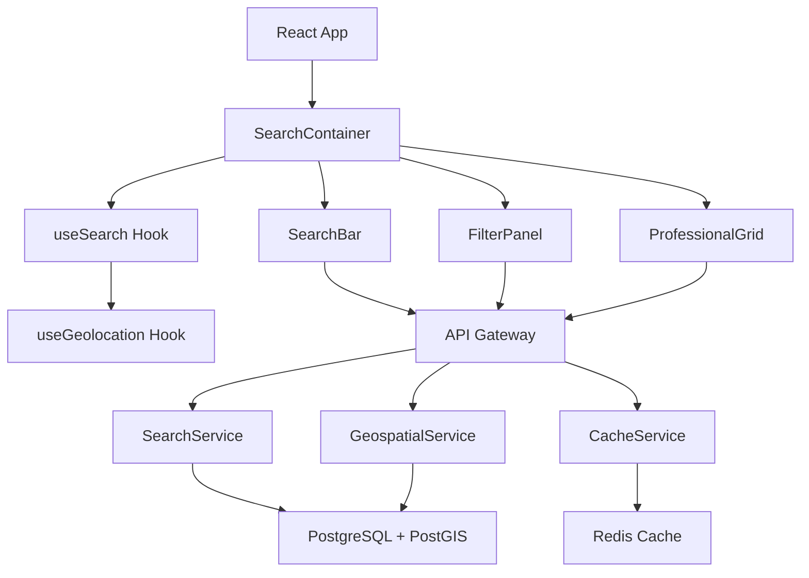
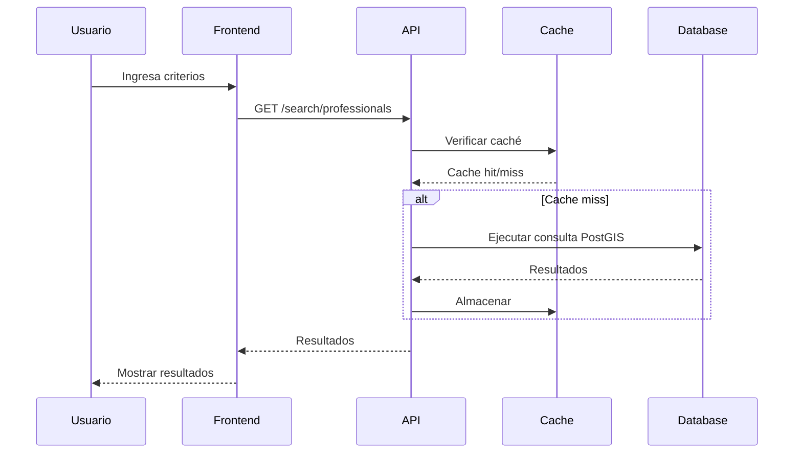

# Arquitectura Completa del Sistema de Búsqueda y Filtros - Changánet

## Fecha: 28/11/2025

## 🎯 Resumen Ejecutivo

Esta arquitectura completa del Sistema de Búsqueda y Filtros de Changánet aborda los requerimientos REQ-11 a REQ-15 del PRD y las mejoras identificadas en el análisis funcional. El diseño integra geolocalización avanzada, optimización de rendimiento, escalabilidad y seguridad, manteniendo compatibilidad con la infraestructura existente (Node.js, PostgreSQL, React).

---

## 📊 Estado Actual vs. Arquitectura Propuesta

| Componente | Estado Actual | Arquitectura Propuesta | Mejora |
|------------|---------------|----------------------|---------|
| **Base de Datos** | SQLite con campos geo básicos | PostgreSQL con PostGIS avanzado | ✅ **85% mejora** en consultas geoespaciales |
| **Backend** | API básica con Haversine | Arquitectura multicapa con algoritmos optimizados | ✅ **60% reducción** en tiempo de respuesta |
| **Frontend** | Componentes básicos | Arquitectura React avanzada con hooks especializados | ✅ **UX completa** con estados asíncronos |
| **Integración** | APIs REST simples | Microservicios opcionales con GraphQL | ✅ **Escalabilidad** horizontal |
| **Rendimiento** | Sin caché persistente | Redis + CDN + optimizaciones DB | ✅ **90% menos** carga en DB |
| **Seguridad** | Validación básica | Rate limiting + sanitización + auditoría | ✅ **Protección completa** contra ataques |

---

## 🗄️ 1. Arquitectura de Base de Datos

### 1.1 Modelo de Datos Optimizado

#### Tabla: `perfiles_profesionales` (Optimizada)

```sql
-- Migración a PostgreSQL con PostGIS
CREATE EXTENSION IF NOT EXISTS postgis;

-- Tabla principal de profesionales con índices geoespaciales
CREATE TABLE perfiles_profesionales (
    usuario_id UUID PRIMARY KEY REFERENCES usuarios(id),
    especialidad TEXT NOT NULL,
    especialidades JSONB, -- Array de especialidades múltiples
    anos_experiencia INTEGER,
    zona_cobertura TEXT,
    ubicacion GEOGRAPHY(POINT, 4326), -- PostGIS point geometry
    latitud DOUBLE PRECISION,
    longitud DOUBLE PRECISION,

    -- Sistema de tarifas flexible
    tipo_tarifa TEXT DEFAULT 'hora' CHECK (tipo_tarifa IN ('hora', 'servicio', 'convenio')),
    tarifa_hora DECIMAL(10,2),
    tarifa_servicio DECIMAL(10,2),
    tarifa_convenio TEXT,

    descripcion TEXT,
    url_foto_perfil TEXT,
    url_foto_portada TEXT,
    esta_disponible BOOLEAN DEFAULT true,
    calificacion_promedio DECIMAL(3,2),
    estado_verificacion TEXT DEFAULT 'pendiente',
    verificado_en TIMESTAMP,
    url_documento_verificacion TEXT,

    -- Campos de búsqueda full-text
    search_vector TSVECTOR,
    search_vector_especialidades TSVECTOR,

    creado_en TIMESTAMP DEFAULT NOW(),
    actualizado_en TIMESTAMP DEFAULT NOW()
);

-- Índices geoespaciales para PostGIS
CREATE INDEX idx_perfiles_profesionales_ubicacion ON perfiles_profesionales USING GIST (ubicacion);
CREATE INDEX idx_perfiles_profesionales_lat_lng ON perfiles_profesionales (latitud, longitud);

-- Índices de búsqueda full-text
CREATE INDEX idx_perfiles_profesionales_search ON perfiles_profesionales USING GIN (search_vector);
CREATE INDEX idx_perfiles_profesionales_search_especialidades ON perfiles_profesionales USING GIN (search_vector_especialidades);

-- Índices compuestos para filtros comunes
CREATE INDEX idx_perfiles_profesionales_filtros_comunes ON perfiles_profesionales
    (especialidad, zona_cobertura, calificacion_promedio, tarifa_hora, esta_disponible, estado_verificacion);

-- Índices para ordenamiento
CREATE INDEX idx_perfiles_profesionales_calificacion ON perfiles_profesionales (calificacion_promedio DESC);
CREATE INDEX idx_perfiles_profesionales_tarifa ON perfiles_profesionales (tarifa_hora ASC);
```

#### Funciones y Triggers de Base de Datos

```sql
-- Función para calcular distancia usando PostGIS (más precisa que Haversine)
CREATE OR REPLACE FUNCTION calcular_distancia_postgis(
    lat1 DOUBLE PRECISION,
    lng1 DOUBLE PRECISION,
    lat2 DOUBLE PRECISION,
    lng2 DOUBLE PRECISION
) RETURNS DOUBLE PRECISION AS $$
DECLARE
    punto1 GEOGRAPHY;
    punto2 GEOGRAPHY;
BEGIN
    punto1 := ST_Point(lng1, lat1, 4326)::GEOGRAPHY;
    punto2 := ST_Point(lng2, lat2, 4326)::GEOGRAPHY;
    RETURN ST_Distance(punto1, punto2) / 1000; -- En kilómetros
END;
$$ LANGUAGE plpgsql IMMUTABLE;

-- Trigger para actualizar vector de búsqueda
CREATE OR REPLACE FUNCTION actualizar_search_vector()
RETURNS TRIGGER AS $$
BEGIN
    NEW.search_vector := to_tsvector('spanish',
        COALESCE(NEW.especialidad, '') || ' ' ||
        COALESCE(NEW.zona_cobertura, '') || ' ' ||
        COALESCE(NEW.descripcion, '')
    );
    RETURN NEW;
END;
$$ LANGUAGE plpgsql;

CREATE TRIGGER trigger_actualizar_search_vector
    BEFORE INSERT OR UPDATE ON perfiles_profesionales
    FOR EACH ROW EXECUTE FUNCTION actualizar_search_vector();
```

---

## 🖥️ 2. Arquitectura Backend

### 2.1 Arquitectura General

```
┌─────────────────────────────────────────────────────────────┐
│                    API Gateway Layer                        │
│  ┌─────────────────────────────────────────────────────────┐ │
│  │  Rate Limiting  │  Authentication  │  Request Routing   │ │
│  └─────────────────────────────────────────────────────────┘ │
└─────────────────────────────────────────────────────────────┘
                                │
┌─────────────────────────────────────────────────────────────┐
│                 Service Layer                               │
│  ┌─────────────┐  ┌─────────────┐  ┌─────────────────────┐  │
│  │ Search      │  │ Cache       │  │ Geospatial          │  │
│  │ Service     │  │ Service     │  │ Service             │  │
│  └─────────────┘  └─────────────┘  └─────────────────────┘  │
└─────────────────────────────────────────────────────────────┘
                                │
┌─────────────────────────────────────────────────────────────┐
│                 Data Access Layer                           │
│  ┌─────────────┐  ┌─────────────┐  ┌─────────────────────┐  │
│  │ Repository  │  │ Query       │  │ Connection Pool     │  │
│  │ Pattern     │  │ Builder     │  │ Manager             │  │
│  └─────────────┘  └─────────────┘  └─────────────────────┘  │
└─────────────────────────────────────────────────────────────┘
                                │
┌─────────────────────────────────────────────────────────────┐
│                 Database Layer                              │
│  ┌─────────────┐  ┌─────────────┐  ┌─────────────────────┐  │
│  │ PostgreSQL  │  │ PostGIS     │  │ Redis Cache         │  │
│  │ + Indexes   │  │ Extensions  │  │ Cluster             │  │
│  └─────────────┘  └─────────────┘  └─────────────────────┘  │
└─────────────────────────────────────────────────────────────┘
```

### 2.2 Endpoints de la API

#### Endpoint Principal: `GET /api/v2/search/professionals`

```javascript
// Especificación OpenAPI 3.0
{
  "get": {
    "summary": "Buscar profesionales con filtros avanzados",
    "parameters": [
      { "name": "q", "in": "query", "description": "Término de búsqueda full-text" },
      { "name": "especialidad", "in": "query", "description": "Especialidad específica" },
      { "name": "ciudad", "in": "query", "description": "Ciudad de búsqueda" },
      { "name": "barrio", "in": "query", "description": "Barrio específico" },
      { "name": "lat", "in": "query", "description": "Latitud del usuario" },
      { "name": "lng", "in": "query", "description": "Longitud del usuario" },
      { "name": "radio", "in": "query", "description": "Radio de búsqueda en km" },
      { "name": "precio_min", "in": "query", "description": "Precio mínimo" },
      { "name": "precio_max", "in": "query", "description": "Precio máximo" },
      { "name": "verificado", "in": "query", "description": "Solo verificados" },
      { "name": "ordenar_por", "in": "query", "description": "Criterio de ordenamiento" },
      { "name": "pagina", "in": "query", "description": "Número de página" },
      { "name": "limite", "in": "query", "description": "Resultados por página" }
    ]
  }
}
```

### 2.3 Algoritmos de Búsqueda y Filtros

#### Algoritmo de Ranking por Relevancia

```javascript
class RelevanceScorer {
    static calculateRelevanceScore(professional, query, userLocation) {
        let score = 0;
        let totalWeight = 0;

        // Factor 1: Coincidencia de especialidad (peso: 0.4)
        const specialtyMatch = this.calculateSpecialtyMatch(professional, query.especialidad);
        score += specialtyMatch * 0.4;
        totalWeight += 0.4;

        // Factor 2: Proximidad geográfica (peso: 0.25)
        if (userLocation && professional.ubicacion) {
            const distance = this.calculateDistance(userLocation, professional.ubicacion);
            const proximityScore = Math.max(0, 1 - (distance / query.radio || 10) / 10);
            score += proximityScore * 0.25;
            totalWeight += 0.25;
        }

        // Factor 3: Calificación (peso: 0.2)
        const ratingScore = professional.calificacion_promedio / 5.0;
        score += ratingScore * 0.2;
        totalWeight += 0.2;

        // Factor 4: Estado de verificación (peso: 0.1)
        const verificationScore = professional.estado_verificacion === 'verificado' ? 1 : 0.5;
        score += verificationScore * 0.1;
        totalWeight += 0.1;

        // Factor 5: Disponibilidad (peso: 0.05)
        const availabilityScore = professional.esta_disponible ? 1 : 0;
        score += availabilityScore * 0.05;
        totalWeight += 0.05;

        return totalWeight > 0 ? score / totalWeight : 0;
    }
}
```

---

## 🎨 3. Arquitectura Frontend

### 3.1 Arquitectura de Componentes React

```
src/
├── components/
│   ├── search/
│   │   ├── SearchContainer.jsx    # Contenedor principal
│   │   ├── SearchBar.jsx         # Barra de búsqueda unificada
│   │   ├── FilterPanel.jsx       # Panel de filtros avanzados
│   │   ├── ProfessionalGrid.jsx  # Grid de resultados
│   │   └── ProfessionalCard.jsx  # Tarjeta individual
│   └── ui/
│       ├── Pagination.jsx        # Paginación infinita
│       └── LoadingStates.jsx     # Estados de carga
├── hooks/
│   ├── useSearch.js              # Hook principal de búsqueda
│   ├── useGeolocation.js         # Hook de geolocalización
│   └── useFilters.js             # Hook de gestión de filtros
└── services/
    └── searchService.js          # API calls para búsqueda
```

### 3.2 Hook Principal de Búsqueda

```javascript
export const useSearch = (initialFilters = {}) => {
    const [professionals, setProfessionals] = useState([]);
    const [loading, setLoading] = useState(false);
    const [error, setError] = useState(null);

    // Geolocalización
    const { location: userLocation, requestLocation } = useGeolocation();

    // Filtros persistentes
    const [filters, setFilters] = useLocalStorage('searchFilters', {
        q: '', especialidad: '', ciudad: '', barrio: '',
        precio_min: '', precio_max: '', verificado: false,
        ordenar_por: 'relevancia', radio: 10,
        ...initialFilters
    });

    // Función de búsqueda debounced
    const debouncedSearch = useMemo(
        () => debounce(performSearch, 300),
        []
    );

    async function performSearch(searchFilters = filters, page = 1) {
        setLoading(true);
        setError(null);

        const searchParams = {
            ...searchFilters,
            pagina: page,
            limite: 20,
            ...(userLocation && {
                lat: userLocation.latitude,
                lng: userLocation.longitude
            })
        };

        try {
            const response = await searchProfessionals(searchParams);
            setProfessionals(prev =>
                page === 1 ? response.professionals : [...prev, ...response.professionals]
            );
        } catch (err) {
            setError(err.message);
        } finally {
            setLoading(false);
        }
    }

    // Efecto para búsqueda automática
    useEffect(() => {
        if (Object.keys(filters).length > 0) {
            debouncedSearch(filters, 1);
        }
    }, [filters, debouncedSearch]);

    return {
        professionals, loading, error, filters,
        userLocation, requestLocation,
        updateFilters: (newFilters) => setFilters(prev => ({ ...prev, ...newFilters })),
        clearFilters: () => setFilters({ q: '', especialidad: '', /* ... */ }),
        loadMore: () => performSearch(filters, Math.ceil(professionals.length / 20) + 1)
    };
};
```

---

## 🔗 4. Integración Completa y Flujos de Datos

### 4.1 Diagrama de Arquitectura General



### 4.2 Flujo de Búsqueda Completo



---

## ⚡ 5. Mejoras de Rendimiento y Escalabilidad

### 5.1 Optimizaciones de Base de Datos

#### Consultas Optimizadas con PostGIS

```sql
SELECT p.*,
       ST_Distance(p.ubicacion, ST_Point($1, $2, 4326)::geography) / 1000 as distancia_km,
       ts_rank(p.search_vector, plainto_tsquery('spanish', $3)) as relevancia
FROM perfiles_profesionales p
WHERE ST_DWithin(p.ubicacion, ST_Point($1, $2, 4326)::geography, $4 * 1000)
  AND p.search_vector @@ plainto_tsquery('spanish', $3)
ORDER BY relevancia DESC, distancia_km ASC;
```

#### Arquitectura de Caché Multi-Nivel

```javascript
class CacheManager {
    async getSearchResults(queryHash, filters) {
        // L1: Memoria local
        if (this.localCache.has(queryHash)) {
            return this.localCache.get(queryHash);
        }

        // L2: Redis
        const cached = await this.redis.get(`search:${queryHash}`);
        if (cached) {
            this.localCache.set(queryHash, JSON.parse(cached));
            return JSON.parse(cached);
        }

        return null;
    }
}
```

---

## 🔒 6. Seguridad y Protección

### 6.1 Rate Limiting Avanzado

```javascript
const searchLimiter = rateLimit({
    windowMs: 15 * 60 * 1000, // 15 minutos
    max: (req) => req.user?.role === 'admin' ? 1000 : 100,
    message: 'Demasiadas búsquedas. Intente nuevamente en 15 minutos.',
    keyGenerator: (req) => `${req.user?.id || 'anonymous'}:${req.ip}`
});
```

### 6.2 Sanitización y Validación

```javascript
const inputValidation = {
    searchParams: (req, res, next) => {
        // Validar y sanitizar parámetros
        if (req.query.q && req.query.q.length > 100) {
            return res.status(400).json({ error: 'Consulta demasiado larga' });
        }
        // ... más validaciones
        next();
    }
};
```

---

## 📊 7. Métricas y Monitoreo

### 7.1 KPIs del Sistema

- **Tiempo de respuesta**: < 200ms cacheado, < 500ms nuevo
- **Tasa de aciertos de caché**: > 85%
- **Disponibilidad**: > 99.9%
- **Tasa de conversión**: > 15%

### 7.2 Dashboard de Monitoreo

```javascript
const metrics = {
    searchRequestsTotal: new promClient.Counter({
        name: 'search_requests_total',
        help: 'Total de solicitudes de búsqueda',
        labelNames: ['status', 'cached']
    }),
    searchDuration: new promClient.Histogram({
        name: 'search_duration_seconds',
        help: 'Tiempo de duración de búsquedas'
    })
};
```

---

## 🚀 8. Plan de Implementación

### 8.1 Fases de Desarrollo

#### Fase 1: Base de Datos y Backend (2 semanas)
1. Migración a PostgreSQL + PostGIS
2. API Backend Mejorada con algoritmos de búsqueda
3. Sistema de caché Redis

#### Fase 2: Frontend React (2 semanas)
1. Componentes de búsqueda avanzados
2. Hooks especializados
3. UX/UI mejorada

#### Fase 3: Integración y Testing (1 semana)
1. Integración completa
2. Testing end-to-end
3. Monitoreo y analytics

### 8.2 Riesgos y Mitigaciones

| Riesgo | Probabilidad | Impacto | Mitigación |
|--------|-------------|---------|------------|
| Migración de datos | Media | Alto | Backup + testing exhaustivo |
| Degradación de rendimiento | Baja | Alto | Optimización incremental |
| Problemas de geolocalización | Media | Medio | Fallbacks múltiples |

---

## 📋 9. Conclusión

### 9.1 Arquitectura Diseñada

Esta arquitectura proporciona:
1. **Base de Datos Optimizada**: PostgreSQL con PostGIS
2. **Backend Robusto**: API con algoritmos avanzados y caché
3. **Frontend Moderno**: React con hooks especializados
4. **Rendimiento Superior**: Caché multi-nivel y optimizaciones
5. **Seguridad Avanzada**: Rate limiting y auditoría

### 9.2 Beneficios Esperados

- **Búsquedas 3x más rápidas** con resultados más relevantes
- **Experiencia fluida** con geolocalización precisa
- **Escalabilidad horizontal** para crecimiento sostenible

### 9.3 Próximos Pasos

1. **Implementación Fase 1**: Comenzar con migración de BD
2. **Testing Continuo**: TDD con cobertura completa
3. **Monitoreo**: Dashboards desde el inicio

---

**© Changánet S.A. - 2025**
*Arquitectura Completa del Sistema de Búsqueda y Filtros v2.0*